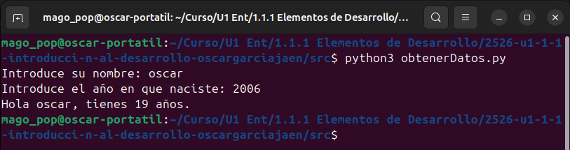
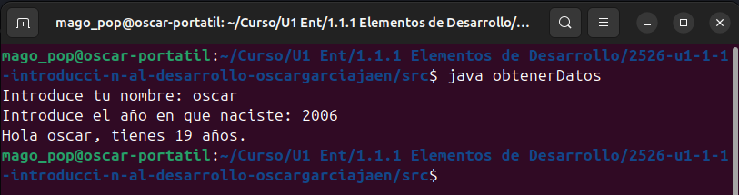
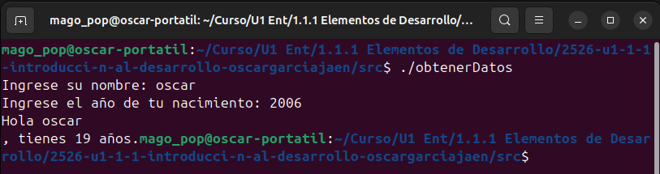

# Práctica 2: Introducción al desarrollo. Ponlo en práctica.

[Descripción de la práctica](https://revilofe.github.io/section3/u01/practica/EDES-U1.-Practica011/)

---

# Elementos de desarrollo

## Identificación de la Actividad
- **ID de la Actividad:** 1.11: Elementos de desarrollo
- **Módulo:** Programación
- **Unidad de Trabajo:** Unidad 1: Introduccion al desarrollo de Software. 
- **Fecha de Creación:** 07/10/2025
- **Fecha de Entrega:** 16/10/2025
- **Alumno(s):** 
  - **Nombre y Apellidos:** Óscar García Jaén
  - **Correo electrónico:** ogarjae565@g.educaand.es
  - **Iniciales del Alumno/Grupo:** OGJ

## Descripción de la Actividad
Evaluar la relación entre software y hardware, clasificar lenguajes de programación y 
comprender los diferentes procesos de ejecución (compilación, interpretación y máquinas virtuales), 
utilizando ejemplos de lenguajes interpretados, compilados y que generan código intermedio para su 
ejecución en una máquina virtual.

## Instrucciones de Compilación y Ejecución
1. **Requisitos Previos:**
   ### Lenguaje de programación y versión
   - Para el lenguaje C era necesario tener instalado tanto el lenguaje para poder desarrollar el programa como un compilador para poder ejecutar el programa.
   - Para el lenguaje Java era necesario tener instalado el JDK.
   - Para el lenguaje Python era necesario tener instalado el lenguaje.

   ### Entorno de desarrollo o dependencias necesarias
   - Para C he usado VS Code descargando los respectivos plugins para su correcto funcionamiento.
   - Para Java he descargado el plugin "Extension Pack for Java" que incluye todo lo necesario para un correcto desarrollo.
   - Para Python descargué el plugin del lenguaje y el Debugger para desarrollar el código y poder comprobar su funcionamiento.


2. **Pasos para Compilar el Código:**

   - Una vez desarrollado el código en C, es necesario compilar el programa con el siguiente comando:

      ```bash
      gcc nombreDelPrograma.c -o nombreDelPrograma
      ```
  
   - Una vez escrito el programa en Java compila el programa con el siguiente comando:

      ```bash
      javac nombreDelPrograma.java
      ```
   
   - Tras crear el programa en python no hace falta compilación asi que pasamos directamente a la ejecución.

3. **Pasos para Ejecutar el Código:**

   - Para ejecutar el programa compilado en C, utiliza el siguiente comando (en Linux):
      
      ```bash
      ./nombreDelPrograma
      ```
   - Para ejecutar el programa con la máquina virtual de java se usa el siguiente comando:

      ```bash
      java nombreDelPrograma
      ```

   - Para ejecutar el programa desarrollado en Python debes introducir el siguiente comando:

      ```bash
      python3 nombreDelPrograma.py
      ```
## Desarrollo de la Actividad
### Descripción del Desarrollo
La actividad ha sido realizada en Python, C y Java, el código ha sido desarrollado en los tres lenguajes previamente dichos, pero con las diferentes sintaxis requeridas por cada uno.

### Código Fuente
- **Java** : [Programa en Java](src/obtenerDatos.java)
- **C**: [Programa en C](src/obtenerDatos.c)
- **Pyhon**: [Programa en Python](src/obtenerDatos.py)

## 5.1. Criterio de Evaluación 1.a: Relación entre Software y Hardware¶

### Describe cómo el software que has creado se ha relacionado con los componentes físicos del dispositivo (memoria RAM, procesador, periféricos, etc.) durante la ejecución de los tres lenguajes (interpretado, compilado y en máquina virtual).

**Python**

Al ejecutar el programa en Python, el intérprete convierte las instrucciones escritas en alto nivel en instrucciones que el procesador puede entender y ejecutar, línea a línea y en tiempo real.

Cuando llega a las instrucciones de entrada, mediante el teclado se recibe la información y se guarda en variables, que se almacenan en espacios gestionados temporalmente en la memoria RAM.

La ALU realiza la operacion aritmética que calcula cuantos años tiene el usuario y lo guarda en una variable en los espacios reservados temporalmente de la RAM.

Finalmente se utiliza el método print para mostrar por la pantalla el mensaje "Hola (nombreIntroducido) tienes (resultadoDelCalculo) años"

**C**

Al ejecutar el programa en C, el código fuente se compila primero en un archivo ejecutable que contiene instrucciones en lenguaje máquina para que el procesador pueda entenderlo y ejecutarlo directamente.

Cuando se inicia la ejecucion, el archivo ejecutable se carga en la memoria RAM, donde las variables como el nombre y el año de nacimiento se almacenan en espacios asignados temporalmente.

La ALU realiza la operación aritmética para calcular cuántos años tiene el usuario, utilizando las instrucciones previamente convetidas a lenguaje máquina, y guarda el resultado en una variable dentro de la memoria RAM.

Finalmente, se utiliza la función printf para mostrar por la pantalla el mensaje "Hola (nombreIntroducido) tienes (resultadoDelCalculo) años".

**Java** 

Al ejecutar el programa en Java, el código fuente se compila primero en bytecode que es interpretado y ejecutado en tiempo real por la Máquina Virtual de Java (JVM).

Durante la ejecución, los datos que el usuario ingresa por teclado se reciben mediante la clase Scanner y se almacenan en variables dentro de la memoria RAM, que son gestionadas por la JVM.

El procesador, siguiendo las instrucciones que la JVM va traduciendo, utiliza la ALU para realizar la operación aritmética que calcula cuántos años tiene el usuario, almacenando el resultado en memoria.

Finalmente, el método System.out.println envía el mensaje al sistema operativo, que gestiona la salida para mostrar en la pantalla el texto: "Hola (nombreIntroducido), tienes (resultadoDelCalculo) años".

---

## 5.2. Criterio de Evaluación 1.c: Diferenciación entre Código Fuente, Código Objeto y Ejecutable

### 1. Explica cómo el código fuente que escribiste se transformó en código objeto y ejecutable en el caso de los lenguajes compilados. ¿Generaste archivos intermedios (código objeto)? ¿Qué nombres tomaron estos archivos? 

**C**

Cuando compilas un programa en C, el código que haces se transforma en varios archivos antes de poder ejecutarse. Primero, el compilador convierte tu código fuente en un archivo llamado código objeto (con extensión .o). Este archivo no se puede ejecutar solo porque aún le faltan partes.

Después, el enlazador junta ese archivo código objeto con las librerías que usaste y crea el archivo final ejecutable, que sí puedes abrir y ejecutar en tu ordenador.

### 2. Para los lenguajes interpretados, describe cómo el código fuente se ejecutó directamente, sin generar archivos de código objeto o ejecutable. 

**Python**

Cuando inicias un programa, el intérprete de Python lee el código y lo traduce en tiempo real a un lenguaje que el procesador puede entender, línea por línea.

Por eso, el código fuente se ejecuta directamente, sin generar archivos intermedios, y no es necesario compilar antes de ejecutarlo.

### 3. Para el lenguaje que genera código intermedio (Java, C#), explica cómo el código fuente se transformó en código intermedio (bytecode) y cómo este fue ejecutado por la máquina virtual. 

**Java**

Cuando escribes un programa en Java, el código fuente se compila en un archivo intermedio llamado bytecode, que tiene extensión .class.

Este bytecode no es un archivo ejecutable para el procesador directamente, sino que está diseñado para ser ejecutado por la Máquina Virtual de Java (JVM). La JVM lee ese bytecode y lo ejecuta en tiempo real, traduciendo las instrucciones a las que entiende el procesador dependiendo del sistema operativo y hardware.

Por tanto, el archivo intermedio generado es el .class con el bytecode, y no se crea un ejecutable como en C. Este bytecode es el que se usa para correr el programa en cualquier sistema que tenga instalada la JVM.

---

## 5.3. Criterio de Evaluación 1.d: Generación de Código Intermedio para Máquinas Virtuales

### 1. Describe el proceso de generación de código intermedio (bytecode) en el lenguaje que utilizaste que emplea una máquina virtual (por ejemplo, Java o C#). 

Cuando escribes un programa en Java, el código fuente tiene una extensión .java, es compilado por el compilador de Java (javac). Este proceso transforma el código en un archivo intermedio llamado bytecode, que se guarda en un archivo con extensión .class.

El bytecode es un lenguaje intermedio diseñado para ser ejecutado por la Máquina Virtual de Java (JVM). La JVM carga el archivo .class, interpreta el bytecode y lo ejecuta en tiempo real, traduciendo las instrucciones a código que entiende el procesador según el sistema operativo y hardware donde se ejecute.

Este proceso permite que el mismo bytecode pueda ser ejecutado en cualquier dispositivo que tenga una JVM instalada, haciendo que los programas Java sean portables y eficientes.

### 2. Explica qué rol juega la máquina virtual en la ejecución del código y cómo difiere de la ejecución directa en un sistema operativo como ocurre con los lenguajes compilados e interpretados.

La JVM interpreta y ejecuta este bytecode en tiempo real, traduciendo el código en instrucciones específicas para el procesador. Este proceso incluye una compilación Just-In-Time (JIT), que convierte partes del bytecode en código máquina mientras el programa esta en proceso de ejecución, mejorando la eficiencia.

En los lenguajes interpretados, como Python, el código fuente se ejecuta directamente usando un intérprete. El intérprete lee el programa línea por línea y traduce cada instrucción a lenguaje máquina en tiempo real, para que el procesador pueda ejecutar cada acción al momento.

---

## 5.4. Criterio de Evaluación 1.e: Clasificación de Lenguajes de Programación

### 1. Clasifica los tres lenguajes utilizados (interpretado, compilado y en máquina virtual) según su:

| Lenguaje | Modo de ejecución      | Nivel de abstracción | Paradigma principal                  |
|----------|-----------------------|---------------------|--------------------------------------|
| Python   | Interpretado          | Alto nivel          | Imperativo, orientado a objetos, funcional |
| C        | Compilado             | Medio/Alto nivel    | Imperativo                           |
| Java     | Máquina virtual (bytecode) | Alto nivel          | Orientado a objetos, imperativo      |

### 2. Explica qué características de estos lenguajes influyeron en su clasificación. Es decir, ahonde en las razones por las que cada lenguaje pertenece a una categoría específica.

**Python**

Python es clasificado como interpretado, ya que su código no se compila, sino que el intérprete lo lee y ejecuta directamente línea por línea. Es un lenguaje de alto nivel porque usa unas sintaxis muy cercanas al lenguaje humano. Además, permite varios paradigmas de programación, aunque destaca por su uso en programación imperativa.

**C**

C se considera un lenguaje compilado porque su código fuente se traduce a código máquina antes de ejecutarse. Es de nivel medio o alto porque, aunque tiene estructuras de control propias de los lenguajes de alto nivel, permite manipular directamente la memoria y los recursos del sistema. Su principal paradigma es el imperativo, ya que se basa en secuencias de instrucciones que cambian el estado del programa paso a paso.

**Java**

Java usa una máquina virtual, porque el código fuente se compila a bytecode y se ejecuta dentro de la JVM. Esto lo hace independiente del sistema operativo. Es un lenguaje de alto nivel porque oculta los detalles del hardware y facilita la programación mediante clases y objetos. Su paradigma principal es la orientación a objetos, aunque también admite estilos imperativos.

---

### 5.5. Criterio de Evaluación 1.f: Evaluación de Herramientas Utilizadas en el Desarrollo

**Sistema operativo (¿en qué sistema ejecutaste el programa?).**

- Ubuntu

**Editor de texto o IDE (¿dónde escribiste el código?).**

- El programa en Python fue escrito en Pycharm.
- Los programas en Java y C fueron escritos en Visual Studio Code.

**Compilador o intérprete (¿cómo se transformó o ejecutó el código?).**

- Python (intérprete): El intérprete lee y ejecuta el código fuente línea por línea en tiempo real, sin generar archivos ejecutables previos.

- C (compilador): El compilador traduce todo el código fuente a código máquina creando un archivo ejecutable antes de que el programa pueda correr.

- Java (máquina virtual): El compilador convierte el código fuente en bytecode intermedio que luego es ejecutado por la máquina virtual, que lo traduce en tiempo real al lenguaje del procesador.

**Depurador (si lo usaste, ¿cómo lo empleaste para encontrar errores?).**

- En esta actividad no usé el depurador.

**Sistema de gestión de versiones (si lo usaste, ¿cómo guardaste las versiones del código?).**

- El código fue guardado una vez funcionaban los tres programas asi que no dispongo de varias versiones del código.

**Otras herramientas Añade alguna herramienta más a la lista. ¿Cómo te ayudó en el desarrollo?**

- El buscador de Google me ayudó bastante a encontrar información y ahora cuenta con respuestas generadas con IA (Gemini), que pueden darte la información de forma más directa ahorrandote mucho tiempo.

## Entrega

### El código fuente de los tres lenguajes elegidos (interpretado, compilado y en máquina virtual). 

- [Java](src/obtenerDatos.java)
- [Python](src/obtenerDatos.py)
- [C](src/obtenerDatos.c)

### Capturas de pantalla de la ejecución del programa en cada lenguaje. 

**Python**



**Java**



**C**



---

## Conclusión Final
### Al final del trabajo, se deberá reflexionar y entregar una conclusión, de no más de 10 líneas, que compare las diferencias entre los tres lenguajes (interpretado, compilado y en máquina virtual), destacando:
**1. Las diferencias de rendimiento.**
**2. La facilidad o complejidad de cada proceso de ejecución.**
**3. Las ventajas y desventajas de cada tipo de lenguaje (interpretado vs compilado vs intermedio).**

En conclusión, los lenguajes compilados como C ofrecen mejor rendimiento porque el código se traduce directamente a instrucciones que el procesador puede ejecutar, aunque requieren un proceso de compilación previo. 

Los lenguajes interpretados como Python permiten una ejecución más flexible y rápida para desarrollar, ya que el código se ejecuta línea por línea en tiempo real, aunque con menor velocidad. 

Los lenguajes que usan máquina virtual, como Java, combinan portabilidad y buen rendimiento al compilar a bytecode que la máquina virtual interpreta o compila justo a tiempo. 

Cada tipo tiene ventajas claras: velocidad y eficiencia para los compilados, facilidad y rapidez para los interpretados, y equilibrio y portabilidad para los que usan máquina virtual.

## Referencias y Fuentes

- https://devdocs.io/c/
- [Tutorial básico de Java.pdf](assets/Tutorial%20b%C3%A1sico%20de%20Java.pdf)

